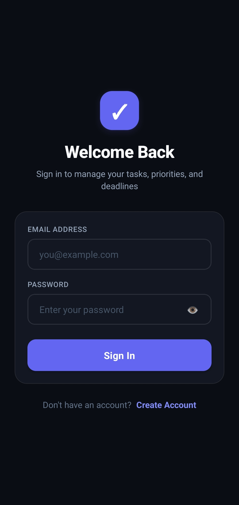
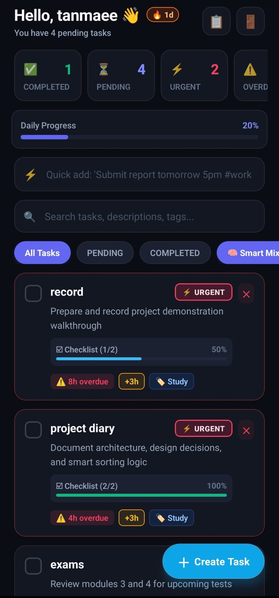
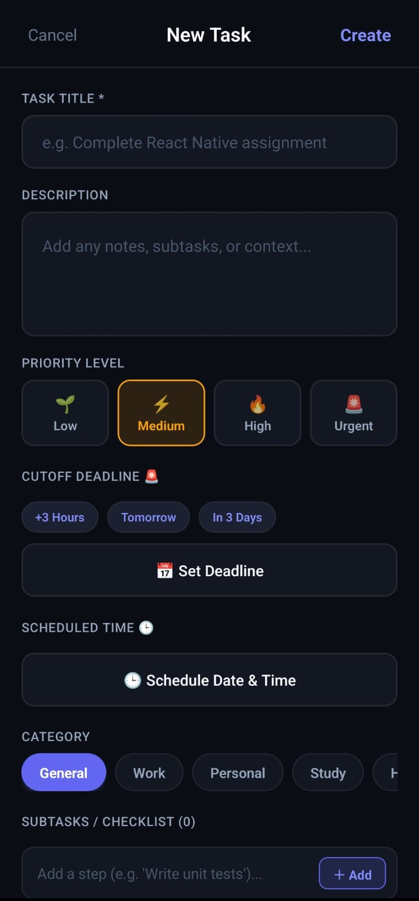
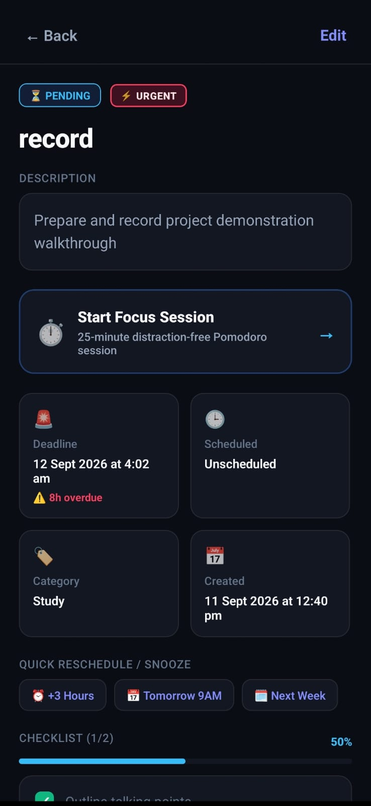

# 🚀 TaskFlow: Full-Stack React Native Android Task Management Ecosystem

A production-ready Android To-Do application built with **React Native CLI (TypeScript)**, **Redux Toolkit (RTK)**, and a modular **Node.js + Express (TypeScript) + MongoDB** backend with JWT authentication, custom in-app calendar scheduling, and an intelligent Priority-Deadline sorting engine.

---

## 🔗 Quick Links & Downloads

| Resource | Link |
| :--- | :--- |
| 📱 **Download Android APK** | [Google Drive APK Link](https://drive.google.com/file/d/1J2MiSYSUc4i3jdH_4bT7sra5TskdWkvK/view?usp=drive_link) |
| 🎥 **Watch App Demo Video** | [Google Drive Video Link](https://drive.google.com/file/d/1yAdIgVEwGc47WVB3bsVmAnfs41R3vawN/view?usp=drive_link) |
| 💻 **GitHub Repository** | [https://github.com/Muskan25-jssateb/ToDo_App](https://github.com/Muskan25-jssateb/ToDo_App) |
| ⚡ **Tech Stack** | React Native (TS) • Node.js / Express • MongoDB • Redux Toolkit |

---

## 📱 App Screenshots

| 🔐 Authentication & Security | 📋 Smart Dashboard & Filters |
| :---: | :---: |
|  |  |
| *Strict validation for unregistered emails & incorrect passwords* | *Electric Indigo filter tabs, Smart Mix sort, & daily progress* |

| 📅 Task Creation & Calendar Picker | ⏱️ Task Details & Focus Timer |
| :---: | :---: |
|  |  |
| *Custom in-app monthly calendar, time stepper & subtask builder* | *25-min Pomodoro timer, 1-tap snooze, & checklist tracking* |

---

## 🌟 Key Highlights & Assignment Features

### 1. User Authentication & Credential Security
- **Strict Validation**: Unregistered email addresses are rejected with clear feedback (`"Account not found. Please create an account first"`). Incorrect passwords for existing users are rejected with (`"Invalid password"`).
- **Per-User Isolation**: Cached task storage is explicitly scoped to individual user IDs (`@todo_app_cached_tasks_${userId}`). Newly created accounts start with a clean, empty dashboard.
- **Security**: Passwords salted and hashed with `bcryptjs` (cost factor 10); JWT access tokens stored securely in `AsyncStorage`.
- **Protected Routing**: Axios interceptors dynamically inject `Authorization: Bearer <token>` into all task requests. Automatic session restoration on app launch.

### 2. Task Management CRUD
- **Comprehensive Fields**: Task title, detailed description, scheduled date/time, cutoff deadline, priority level (`LOW`, `MEDIUM`, `HIGH`, `URGENT`), status (`PENDING`, `COMPLETED`), subtasks checklist, and categories/tags.
- **Pure React Native Calendar & Time Picker**: In-app custom modal with month navigation and time steppers, eliminating crashes associated with third-party native dialog fragments.
- **Atomic Status Toggling**: Checkbox interaction updates status instantly with strike-through animations.
- **Task Deletion & Editing**: Modal edit workflow and confirmation alerts for deletions.

### 3. Bonus: "Smart Mix" Urgency Sorting Algorithm
In addition to standard sorting (`Deadline`, `Priority`, `Newest`), TaskFlow features an intelligent **Smart Mix Heuristic** that dynamically scores tasks based on:
$$\text{UrgencyScore} = (W_{\text{priority}} \times P) + \text{DeadlinePenalty} + (W_{\text{age}} \times \text{HoursOld})$$

- **Priority Weights**: `URGENT` = 120, `HIGH` = 80, `MEDIUM` = 40, `LOW` = 15.
- **Deadline Escalation**:
  - Overdue tasks get an automatic **+300 to +500 point escalation**.
  - Tasks due within **6 hours** receive a dynamic **+250 to +310 point boost**.
  - Tasks due within **24 hours** get **+150 to +246 points**.
- **Anti-Starvation Age Factor**: Older pending tasks slowly accumulate points so low-priority tasks don't get neglected indefinitely.
- **Completed Tasks**: Automatically sink to the bottom with negative scores.

### 4. 🌟 Creative & High-Impact Bonus Features
1. **🧠 Smart Natural Language Quick-Add (NLP Parser)**:
   - Type commands like `"Submit assignment tomorrow 5pm #study !urgent"`.
   - Automatically extracts task title, scheduled deadline, category, and priority level with live preview pills.
2. **⏱️ In-App Pomodoro Focus Mode**:
   - Built-in 25-minute Deep Work and 5-minute Rest cycle countdown timer directly inside the task detail view.
   - Includes play, pause, reset, progress percentage, and direct "Mark as Completed" upon finishing.
3. **☑️ Subtasks Checklist & Micro-Progress Bar**:
   - Add multiple steps/subtasks to any task.
   - Interactive checkbox tracking with live progress calculation (e.g. `2/3 subtasks (67%)`) displayed on cards and details.
4. **⚡ 1-Tap Quick Snooze & Reschedule**:
   - One-tap buttons (`+3 Hours`, `Tomorrow 9:00 AM`, `Next Week`) on both task cards and details to reschedule slipping deadlines.
5. **📋 Daily Briefing Export (Native Share)**:
   - One-tap "Share Daily Briefing" on the home header formatting today's agenda into Markdown for sharing to Slack, WhatsApp, or Email.
6. **🔥 Productivity Streaks & Inbox Zero Celebration**:
   - Tracks consecutive days of completed tasks in persistent storage (`🔥 3-Day Streak`).
   - Automatically renders an animated celebration card when all pending tasks are cleared.

---

## 📂 Project Architecture

```text
TODO/
├── backend/                      # Node.js + Express + TypeScript + MongoDB API
│   ├── src/
│   │   ├── config/               # Database connection (Mongoose)
│   │   ├── controllers/          # authController.ts, taskController.ts
│   │   ├── middlewares/          # JWT auth guard, global error handler
│   │   ├── models/               # User.ts, Task.ts schemas
│   │   ├── routes/               # authRoutes.ts, taskRoutes.ts
│   │   ├── utils/                # smartSort.ts algorithm
│   │   └── server.ts             # Express entrypoint
│   ├── tsconfig.json
│   ├── package.json
│   └── .env
│
└── mobile/                       # React Native CLI (TypeScript)
    ├── src/
    │   ├── api/                  # Axios client & multi-endpoint fallback service
    │   ├── components/           # TaskCard, DateTimePickerModal, FocusTimerModal, FilterPill, CustomInput, CustomButton
    │   ├── navigation/           # AppNavigator, AuthNavigator, MainNavigator
    │   ├── screens/              # LoginScreen, RegisterScreen, HomeScreen, AddEditTaskModal, TaskDetailScreen
    │   ├── store/                # Redux Toolkit (authSlice, taskSlice)
    │   ├── theme/                # Colors (Electric Indigo), Typography design tokens
    │   ├── types/                # Complete TypeScript definitions
    │   └── utils/                # dateUtils.ts, smartSorting.ts, nlpParser.ts
    ├── App.tsx
    ├── index.js
    ├── tsconfig.json
    └── package.json
```

---

## ⚡ Getting Started

### Prerequisites
- Node.js (v18+)
- MongoDB (Running locally on `mongodb://127.0.0.1:27017` or a MongoDB Atlas URI)
- Android Studio / Android SDK (for React Native Android builds)

---

### Step 1: Start the Backend API

```bash
cd backend
npm install
npm run dev
```
* The API will listen on `http://localhost:5000`.
* Health check: `GET http://localhost:5000/api/health`

#### Environment Configuration (`backend/.env`):
```env
PORT=5000
MONGODB_URI=mongodb://127.0.0.1:27017/todo-app
JWT_SECRET=super_secure_jwt_secret_key_change_in_production_987654321
JWT_EXPIRES_IN=7d
```

---

### Step 2: Run the React Native App

```bash
cd mobile
npm install --legacy-peer-deps

# Start Metro bundler:
npm start

# Run Android build (in another terminal):
npm run android
```

---

## 📡 Backend API Endpoints

| Method | Endpoint | Auth | Description |
| :--- | :--- | :--- | :--- |
| `POST` | `/api/auth/register` | Public | Create new user account (name, email, password) |
| `POST` | `/api/auth/login` | Public | Login with email & password, returns JWT token |
| `GET` | `/api/auth/me` | Bearer | Fetch current authenticated user profile |
| `GET` | `/api/tasks` | Bearer | Fetch tasks with query params (`?status=`, `?priority=`, `?category=`, `?search=`, `?sortBy=smart\|deadline\|priority`) |
| `POST` | `/api/tasks` | Bearer | Create a new task (title, description, dates, priority, category, tags) |
| `PUT` | `/api/tasks/:id` | Bearer | Update task details |
| `PATCH`| `/api/tasks/:id/toggle` | Bearer | Toggle status between `PENDING` and `COMPLETED` |
| `DELETE`| `/api/tasks/:id` | Bearer | Permanently delete task |
